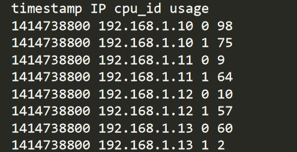

# ServerMonitoringSystem
A monitoring system which lets you simulate logs and query the CPU usage

# This Applications monitors the CPU usage for any given day for any server and lets user query the Status of CPU usage at any given time.

## Navigate to code folder and execute below
	 javac SolutionMain.java
## Generate the jar file using
	 jar cvfe JAR_NAME.jar SolutionMain *.class
## To run the monitoring system in Windows use
### To Simualte logs and generate the file
some_folder_path: Folderpath of log file
		
		java -jar JAR_NAME.jar SIMULATOR some_folder_path

### To Launch the tool to let user Query the server status

		java -jar JAR_NAME.jar RETRIEVER some_folder_path

## To run the app in UNIX system

	Follow the same steps to get a JAR file and then follow below command to generate logs and launch the tool.
	DATA_PATH : Folderpath of log file
		./generate.sh DATA_PATH
		./query.sh DATA_PATH

### In unix simualation of logs

### Query Usage

### [Refer Output_Report for detailed instructions](https://github.com/kalyaniyaganti9/ServerMonitoringSystem/blob/master/Output_Report.pdf)
